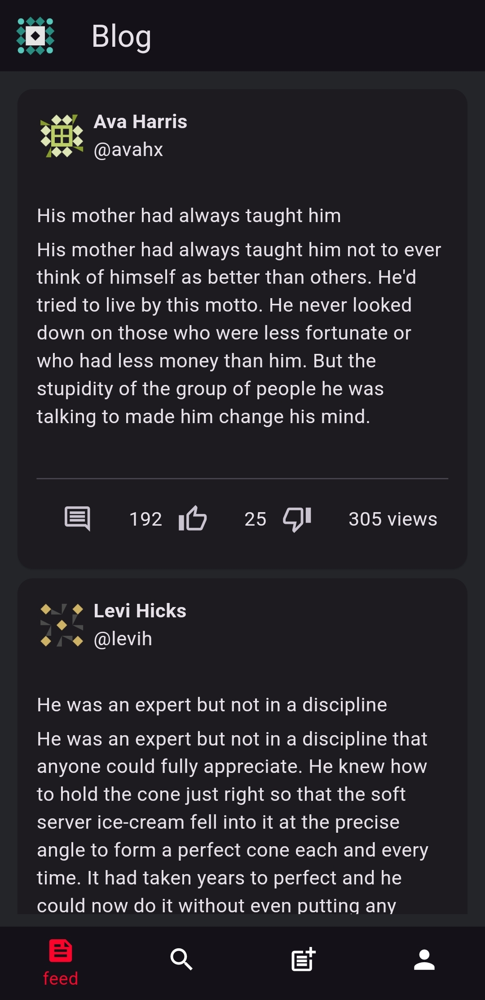

# Blog_Mobile -   
## Descrição

Este é um projeto de aplicativo de simulação de blog desenvolvido com o objetivo de praticar e aprimorar 
habilidades no uso do Flutter, um framework de desenvolvimento de aplicativos móveis. 
A aplicação permite aos usuários criar, editar e visualizar postagens de blog. Entre os recursos oferecidos estão login e registro, navegação entre postagens, visualização detalhada dos posts, e página de perfil do usuário.

### Capturas de Tela
<div style="display: flex;">
  
  
  
</div>

## Acesso pelo Android
1. Acesse a seção de releases do projeto no GitHub.
2. Faça o download do arquivo APK.
3. Instale e abra o app.

## Acesso pela Web
Acesse [aqui](https://manuelferreira90.github.io/blog_flutter/).

## API
O app faz uso da API [dummyjson](http://dummyjson.com/)

## Instruções de instalação
1. Clone o repositório do projeto em sua máquina local.
2. Navegue até a raiz do projeto.
3. No terminal, execute o comando abaixo para instalar as dependências do projeto.
```bash
flutter pub get
